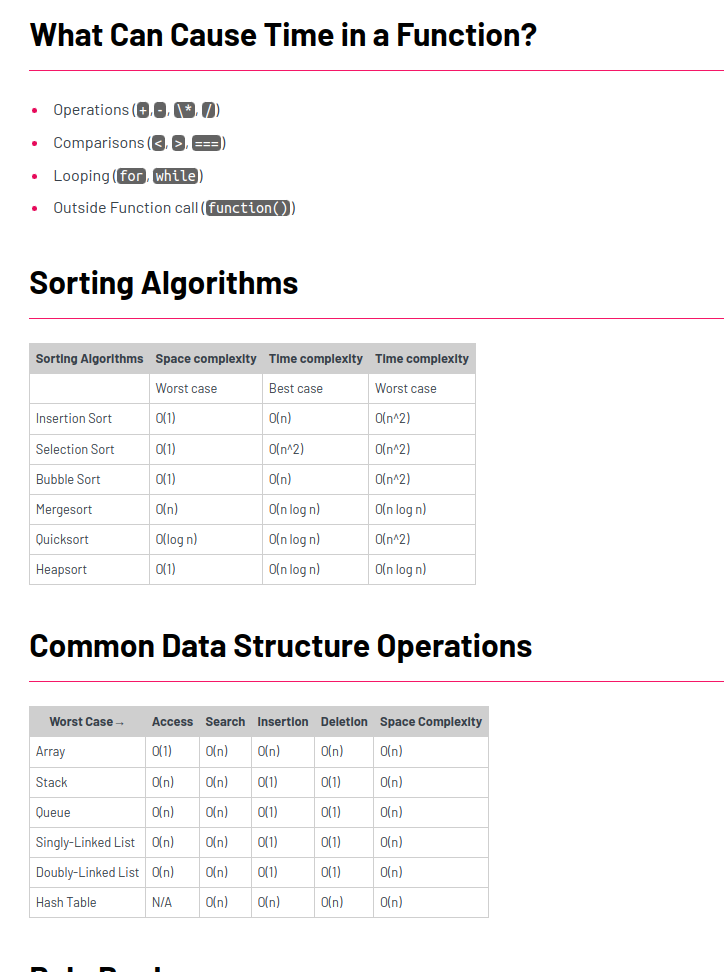

# studyDSA

## 1. Big O

What is big o?
 - Big O is a way to measure the efficiency of an algorithm. It is a way to describe how the runtime of an algorithm grows as the input size grows. It is a way to describe the upper bound of the runtime of an algorithm.
 - Guide : https://zerotomastery.io/cheatsheets/big-o-cheat-sheet/?utm_source=udemy&utm_medium=coursecontent





What is a good code?

- Readable & Scalable (big O here.)


 - O (N) - Linear Time (proportionally)

Grows up in a 1:1 sequence in terms of elements / operations.
In other words, we can say that we always need to do all the operations for each element.

When u have loop, it's automatically O (n), 

- O (1) - Constant Time

It doesn't matter how many elements we have, the number of operations is always the same.
I.E - > You just print the first element of an array, or any predetermined operation.

- Rules Explain:

R1 - If u can stop the loops to find the term, do IT, you reduce complexity to just O(1,2,3) instead O (n)

R2 - Does not matter how many constants O(n + 22020), drop the constants.

R3 - 2 different Input -> different variables, like O(N + M)
 
- O (n * ² ) - Quadratic Time - if we have 2 elements, we have four operations, if 3, then 9 operations 

This case happens when u have nested loops.

2 Scenarios : When u have 2 arrays, if they are nested (alinhados), you multiply, if don't, you just +

- O (log N) - Logarithmic Time

It's the opposite of exponential time, it's the most efficient way to search for something in a sorted array.

Code Example

```go
func binarySearch(arr []int, target int) int {
    low := 0
    high := len(arr) - 1
    for low <= high {
        mid := (low + high) / 2
        if arr[mid] == target {
            return mid
        } else if arr[mid] < target {
            low = mid + 1
        } else {
            high = mid - 1
        }
    }
    return -1
}
```

- O (N log N) - Linearithmic Time

It's the most efficient way to sort an array

Code Example : 

```go 
func quickSort(arr []int) []int {
    if len(arr) < 2 {
        return arr
    } else {
        pivot := arr[0]
        var less []int
        var greater []int
        for _, v := range arr[1:] {
            if v <= pivot {
                less = append(less, v)
            } else {
                greater = append(greater, v)
            }
        }
        less = quickSort(less)
        greater = quickSort(greater)
        less = append(less, pivot)
        less = append(less, greater...)
        return less
    }
}
```

- O (2 ^ N) - Exponential Time

It's the worst case scenario, it's the most inefficient way to search for something in an array.

- O (N!) - Factorial Time


## 2. Resolving Coding interview

### 4 points:

1. Analytics skills - They wanna hear your thinking process 


### Content:


